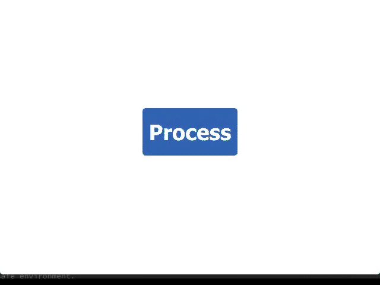

Cool QML Button I implemented in QML! Try to watch the gif below and implement before looking at the source as a challenge.

(Original concept/inspiration by Andrew Millen: https://codepen.io/andrewmillen/full/MoKLob)
